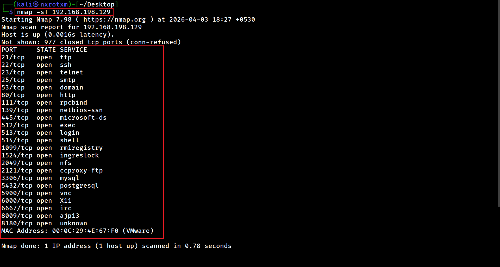
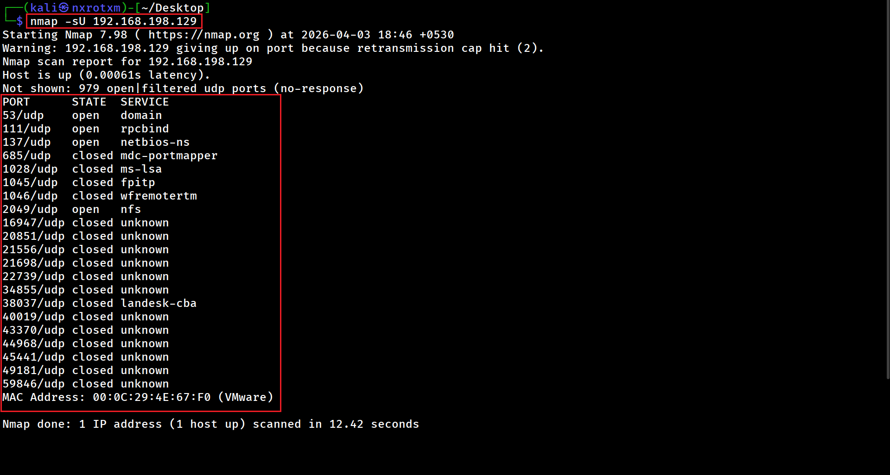
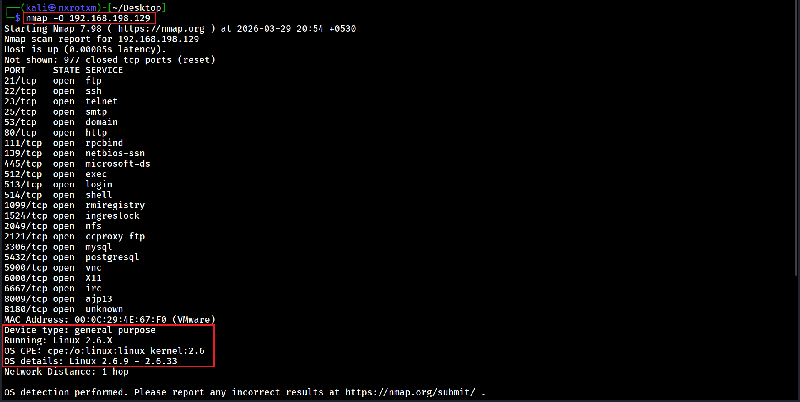
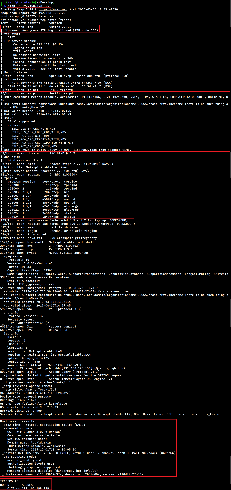
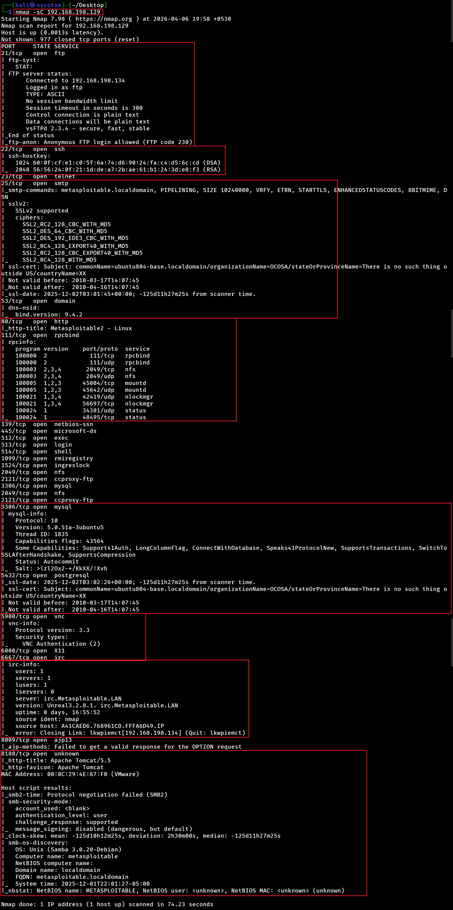
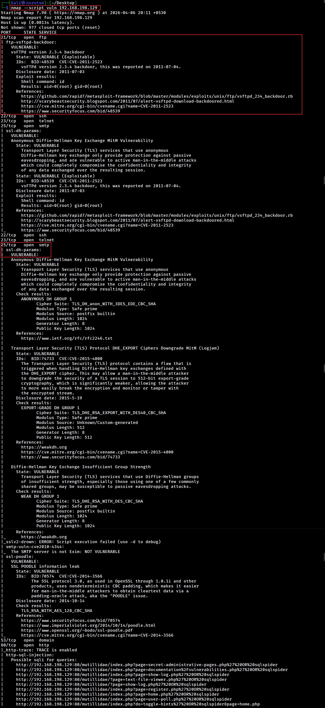
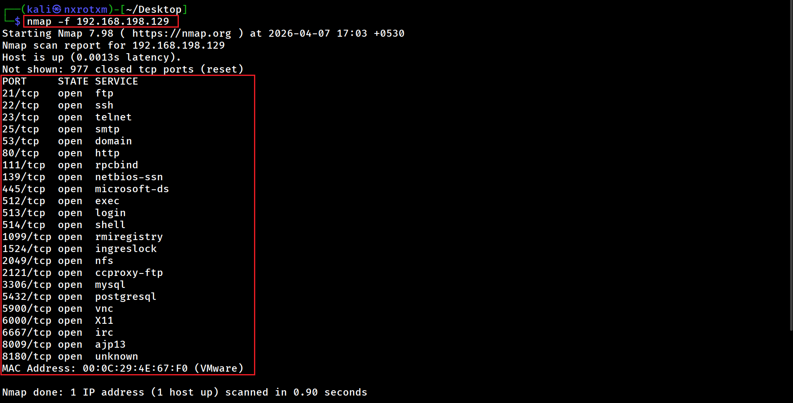
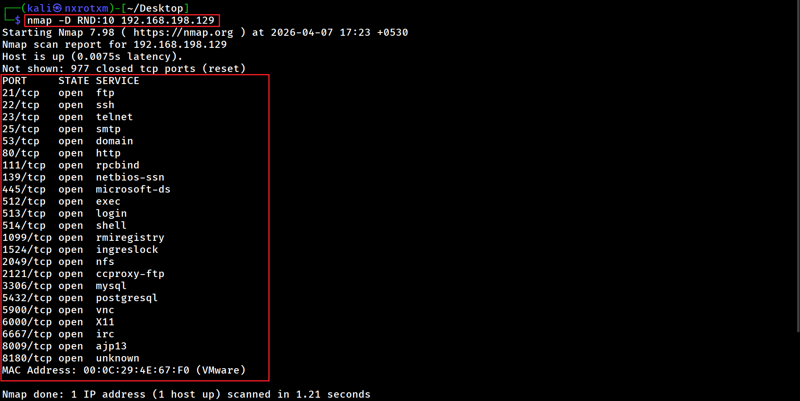
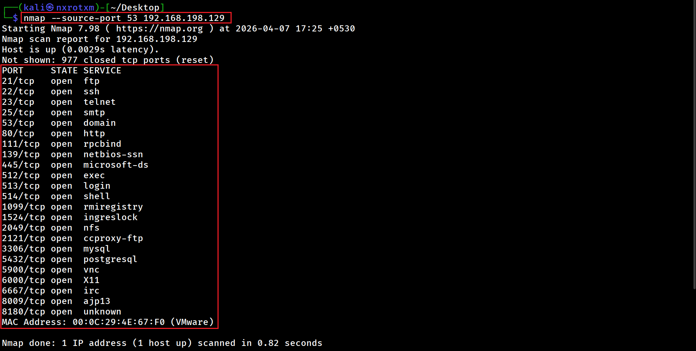

# 📘 Chapter 4 : Advanced Scanning & Stealth Techniques

---

## 🧠 Objective of This Chapter

By the end of this chapter, you will be able to:

- 🕵️ Perform stealthy scans  
- 🔍 Detect services and operating systems  
- ⚙️ Use advanced Nmap features  
- 🛡️ Understand how to avoid detection  

---

## ⚡ Why Advanced Scanning Matters

Basic scans are:

- 📢 Noisy  
- 🧾 Easily logged  
- 🚫 Detectable by firewalls  

---

## 🚀 Advantages of Advanced Scanning

Advanced scanning techniques help you:

- 🕶️ Stay hidden  
- 🧠 Gather deeper information  
- 🛡️ Bypass security defenses  

---

### 🔹 Command 1 : Stealth Scan (SYN Scan)

### 📌 Description:

- Performs a half-open scan and does not complete the handshake.
- Performs a stealth scan that is less detectable.
- The output will be the same as a basic scan and will display all open ports along with the services running on them.

### 📷 Output:

---

### 🔹 Command 2 : TCP Connect Scan

### 📌 Description:

- Performs a scan using a complete TCP handshake.
- Since it completes the TCP handshake, it is more reliable.
- Because it completes the TCP handshake, it is easily detectable and logged.
- 

### 📷 Output:

---

### 🔹 Command 3 : UDP Scan

### 📌 Description:

- Scans for UDP services.

### 📷 Output:

---

### 🔹 Command 4 : Service Version Detection scan

### 📌 Description:

- Performs a port scan with service version detection.
- Scans 1,000 common ports and identifies services along with their versions.
- Attackers can identify vulnerabilities and exploits based on service version information.
- Outdated services may contain vulnerabilities that can be exploited.

### 📷 Output:

---

### 🔹 Command 5 : OS Detection scan

### 📌 Description:

- Attempts to identify the operating system of the host.
- Performs port scanning with operating system detection.
- Attackers perform OS detection scans so that they can find specific exploits related to the OS and service versions.

### 📷 Output:

---

### 🔹 Command 10 : Aggressive Scan

### 📌 Description:

- Performs OS detection, version detection,traceroute, and script scanning.

### 📷 Output:

---

### 🔹 Command 11 : Default Script Scan

### 📌 Description:

- Performs default script scanning on all open ports.

### 📷 Output:

---

### 🔹 Command 12 : Vulnerability Script Scan

### 📌 Description:

- Performs a vulnerability scan on all open ports.
- Not all screenshots are included below because it would be too long.

### 📷 Output:

---

## 🔥 Types of Scripts

- vuln → vulnerabilities
- auth → authentication checks
- brute → brute-force attempts

---

### 🔹 Command 13 : Packet Fragmentation Scan

### 📌 Description:

- Performs port scanning by sending fragmented packets.
- It Bypasses simple firewalls.

### 📷 Output:

---

### 🔹 Command 14 : Decoy Scan

### 📌 Description:

- Performs port scanning by sending fake IPs.
- It hides your real IP.

### 📷 Output:

---

### 🔹 Command 15 : Source Port Manipulation Scan

### 📌 Description:

- Performs port scanning by sending packets from port 53.
- Firewalls trust DNS traffic, so it will not block the packets.

### 📷 Output:

---

# 🔥 There are also commands available for speed and performance tuning.

- **nmap -T0 192.168.198.129**
   - Sends packets very slowly.
   - Avoid detection systems (IDS/IPS).
   - Extremely stealthy.

- **nmap -T1 192.168.198.129**
   - Slightly faster than T0, still very slow.
   - Stealth scanning with less time.
   - Still avoids many detection systems.
 
- **nmap -T2 192.168.198.129**
   - Slows scan to reduce network load.
   - When you don’t want to overload target.
   - Good for stable and careful scanning.
 
- **nmap -T3 192.168.198.129**
   - Default timing.
   - Balanced speed and accuracy.
   - Safe choice if unsure.

- **nmap -T4 192.168.198.129**
   - Faster scanning.
   - Faster results.
   - Works well in lab/CTF.

- **nmap -T5 192.168.198.129**
   - Extremely fast.
   - Very fast scans in controlled environments.
   - Used only when speed matters more than accuracy.

- **nmap--min-rate 1000 192.168.198.129**
   - Send packets no slower than 1000 per second.

- **nmap--max-retries 2 192.168.198.129**
   - Caps number of port scan probe retransmissions.

---

### ⏱️ Timing Strategy
- T0–T2 → Stealth scanning
- T3 → Default
- T4–T5 → Fast scanning

---

# 🔥 BEST COMMAND (You Should Use)

## **nmap -sS -sV -T4 192.168.198.129**

---

  ⚡ “Scan smarter, not louder.” ⚡
---
