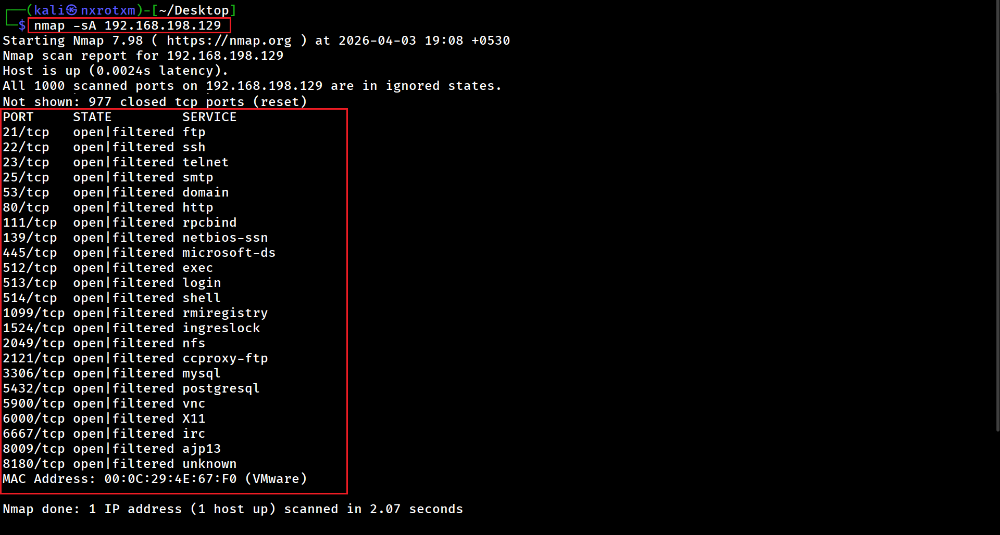
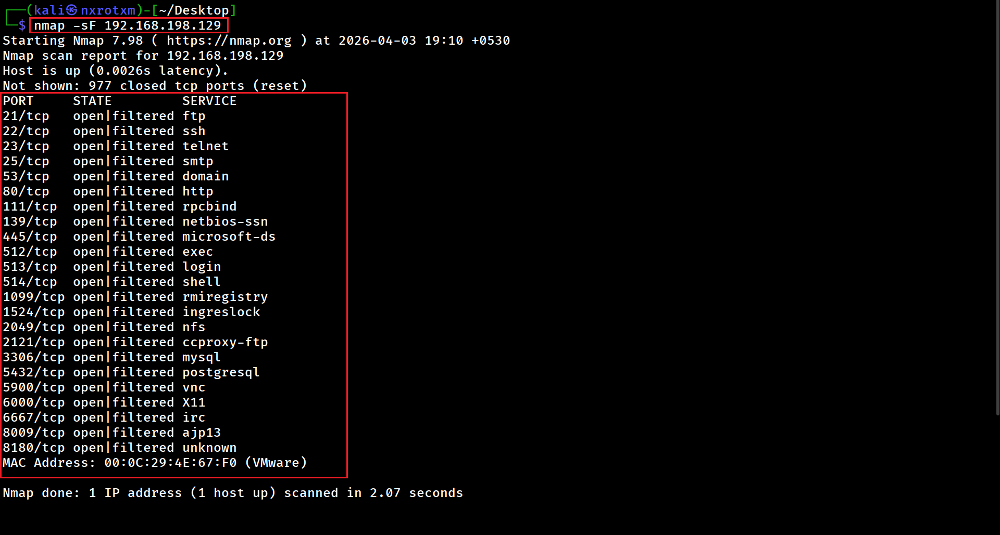
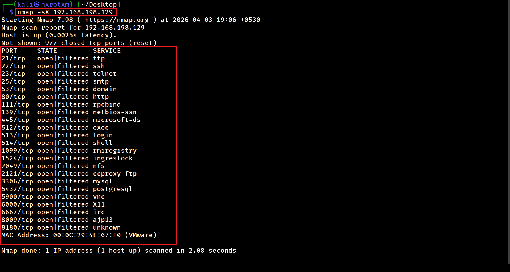

# 🔍 Nmap Complete Guide (Beginner to Advanced)

## 📘 Introduction

Nmap (Network Mapper) is a powerful tool used for network discovery and security auditing.

## 🔍 Understanding Network Scanning

Before attacking a system, a hacker must first **understand it**.

Network scanning is the process of:

- 🖥️ Discovering live systems  
- 🔓 Identifying open ports  
- 🧭 Mapping running services

---

### 🧠 Concept

Think of it like:
**"Walking around a house and checking which doors and windows are open."**

---

### 🎯 Why It Matters

Network scanning helps you:

- Find potential entry points  
- Understand system exposure  
- Plan further actions effectively  

---

### ⚡ Summary

| Step | Description |
|------|------------|
| 🔎 Discovery | Find active devices |
| 🚪 Ports | Check open doors (ports) |
| 🛠️ Services | Identify what's running |

---

## 🧠 How Nmap Works (Behind the Scenes)

When you run a scan like:
- nmap target

Nmap performs the following steps during a scan:

- 🌐 Resolves domain → IP address  
- 📡 Sends packets to target ports  
- 📊 Analyzes responses  
- 🧠 Classifies port states  

---

### 🚪 Port Classification

- 🟢 **Open** → Service is running  
- 🔴 **Closed** → No service  
- 🟡 **Filtered** → Firewall blocking access  

## ⚙️ Lab Setup

* Kali Linux (Attacker)
* Metasploitable2 (Target)

---

# 🧠 Chapter 1: BASIC NMAP COMMANDS

### 🔍 Introduction to Basic Scanning

🔹 Basic scanning in Nmap is used to:

- Discover live hosts
- Identify open ports
- Get an initial understanding of a network
- These scans are fast, simple, and essential before moving to advanced techniques.

---

### 🔹 Command 1 : Host Discovery scan

 

### 📌 Description:

- Scans the entire network to identify and display live hosts.
- It does not scan ports.

### 📷 Output:

---

### 🔹 Command 2 : Basic scan/default scan

  

### 📌 Description:

- This is the default scan performed by Nmap.
- Scans the 1,000 most common ports.
- Scans the top 1,000 common ports and shows open ports with their running services.

### 📷 Output:

---

### 🔹 Command 3 : Multiple Target scan

  

### 📌 Description:

- Scans multiple IPs in one command.
- Used to quickly identify open ports on multiple IPs.

### 📷 Output:

---

### 🔹 Command 4 : Scan Entire Network

  

### 📌 Description:

- Scans all 256 IPs in a network.
- Used to quickly identify open ports for available IPs in entire network.

### 📷 Output:

---

### 🔹 Command 5 : Specific Port Scan

- Performs a scan to identify and display a single open port.
  
### 📷 Output:

---

### 🔹 Command 6 : Multiple Port Scan

- Performs a scan to identify and display only the specified open ports.
  
### 📷 Output:

---

### 🔹 Command 7 : All Port Scan

- Scans all 65,535 ports and displays open ports.
- Useful for deep enumeration
  
### 📷 Output:

---

### 🔹 Command 8 : Fast Port Scan

- Performs a scan to identify and display the top 100 open ports.
- Faster, but less detailed.
  
### 📷 Output:

---

### 🔹 Command 11 : Skip Ping Scan

### 📌 Description:

- Skips ping
- Assumes the host is up.
- This option is used when the firewall blocks ICMP packets.

### 📷 Output:

---

### 🔹 Command 12 : Save Outout

### 📌 Description:

- Saves results for later analysis.
- There are additional options to save output. For example, -oX saves in XML format, -oG in grepable format, and -oA saves all formats at once.

### 📷 Output:

---

# 🧠 Chapter 2: ADVANCED NMAP COMMANDS

### 🔍 Advanced scanning helps you:

- Stay stealthy
- Detect services and OS
- Discover vulnerabilities
- Bypass firewalls.

---

### 🔹 Command 1 : Stealth Scan (SYN Scan)

### 📌 Description:

- Performs a half-open scan and does not complete the handshake.
- Performs a stealth scan that is less detectable.
- The output will be the same as a basic scan and will display all open ports along with the services running on them.

### 📷 Output:

---

### 🔹 Command 2 : TCP Connect Scan

### 📌 Description:

- Performs a scan using a complete TCP handshake.
- Since it completes the TCP handshake, it is more reliable.
- Because it completes the TCP handshake, it is easily detectable and logged.
- 

### 📷 Output:

---

### 🔹 Command 3 : UDP Scan

### 📌 Description:

- Scans for UDP services.

### 📷 Output:

---

### 🔹 Command 4 : Service Version Detection scan

### 📌 Description:

- Performs a port scan with service version detection.
- Scans 1,000 common ports and identifies services along with their versions.
- Attackers can identify vulnerabilities and exploits based on service version information.
- Outdated services may contain vulnerabilities that can be exploited.

### 📷 Output:

---

### 🔹 Command 5 : OS Detection scan

### 📌 Description:

- Attempts to identify the operating system of the host.
- Performs port scanning with operating system detection.
- Attackers perform OS detection scans so that they can find specific exploits related to the OS and service versions.

### 📷 Output:

---

### 🔹 Command 10 : Aggressive Scan

### 📌 Description:

- Performs OS detection, version detection,traceroute, and script scanning.

### 📷 Output:

---

### 🔹 Command 5 : ACK Scan

### 📌 Description:

- Performs scan usinsg tcp ACK flag.

### 📷 Output:

---

### 🔹 Command 6 : FIN Scan

### 📌 Description:

- Performs scan usinsg tcp FIN flag.

### 📷 Output:

---

### 🔹 Command 7 : XMAS Scan

### 📌 Description:

- Performs XMAS scan.

### 📷 Output:

---

### 🔹 Command 7 : NULL Scan

### 📌 Description:

- Performs NULL scan.

### 📷 Output:

---

### 🔹 Fast Scan:

nmap -F <target>

---

## 🧠 Chapter 7: Nmap Scripts (NSE)

### 🔹 Command:

nmap --script vuln <target>

### 📌 Description:

Runs vulnerability detection scripts.

---

## 🧠 Chapter 8: Saving Output

### 🔹 Command:

nmap -oN output.txt <target>

### 📌 Description:

Saves scan results to a file.

---

## 🧠 Key Learnings

* Network reconnaissance techniques
* Different types of scanning methods
* Importance of service and OS detection

---

## ⚠️ Disclaimer

This project is for educational purposes only.
