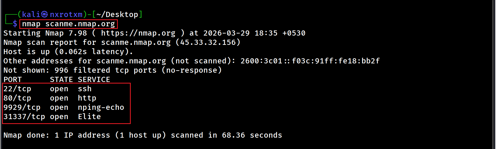
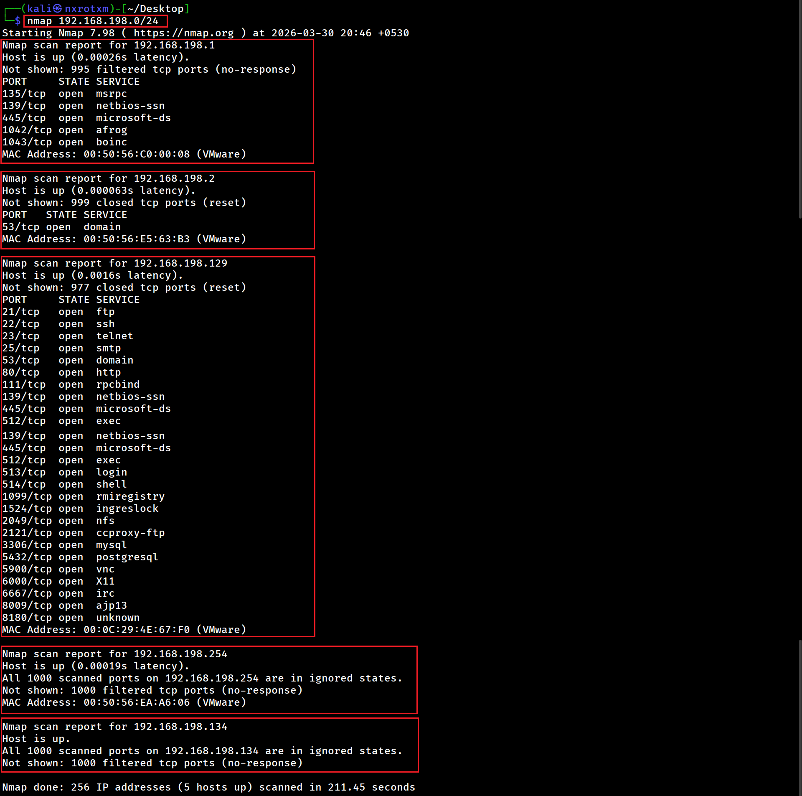
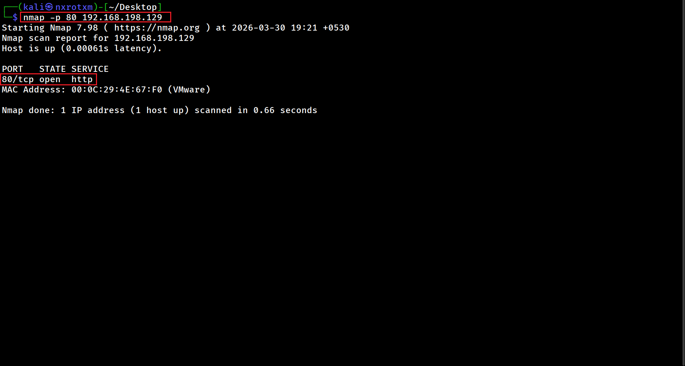
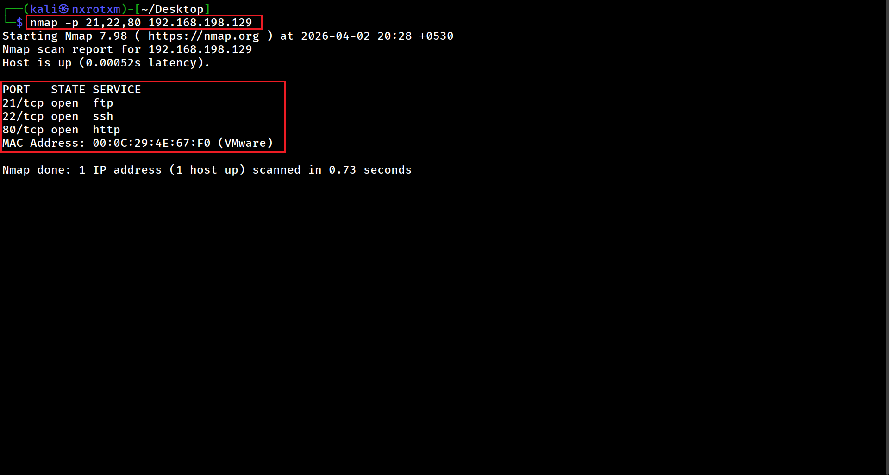
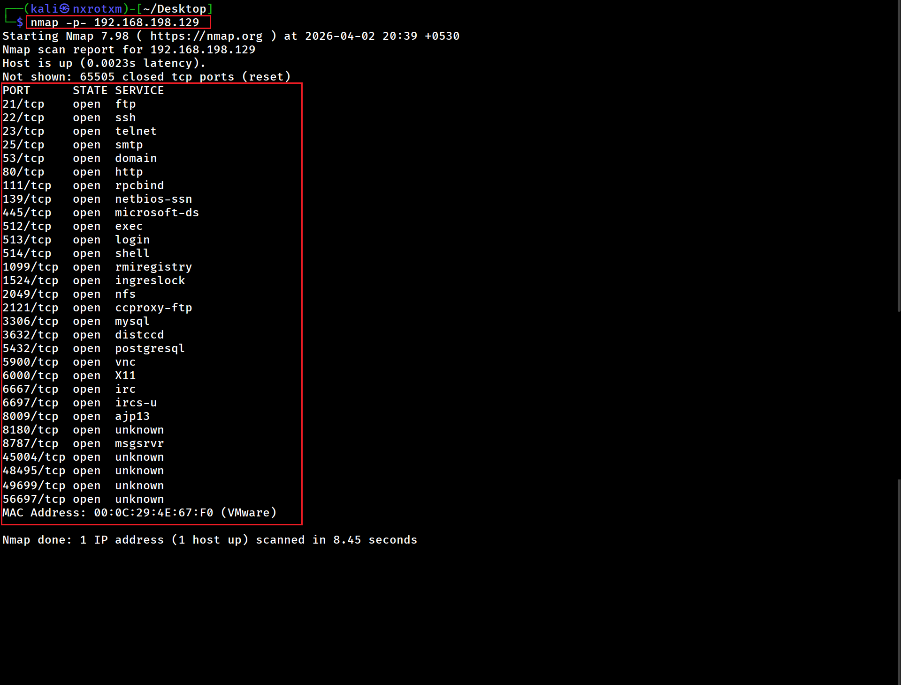

# 🔍 Nmap Complete Guide (Beginner to Advanced)

## 📘 Introduction

Nmap (Network Mapper) is a powerful tool used for network discovery and security auditing.

These are used in initial reconnaissance (beginner level)

---

## ⚙️ Lab Setup

* Kali Linux (Attacker)
* Metasploitable2 (Target)

---

## 🧠 Chapter 1: Basic Commands for Scanning

### 🔹 Command 1 : Host Discovery scan

 

### 📌 Description:

- scan entire network and display available hosts.

### 📷 Output:

---

### 🔹 Command 2 : Basic scan/default scan

  

### 📌 Description:

- Default scan of nmap.
- Used to quickly identify open ports.
- Scan top 1000 common ports and displays all open ports with running service with that port.

### 📷 Output:

---

### 🔹 Command 3 : Multiple Target scan

  

### 📌 Description:

- Scan multiple target with single command.
- Used to quickly identify open ports for multiple target.

### 📷 Output:

---

### 🔹 Command 4 : Scan Entire Network

  

### 📌 Description:

- Scan enitre network.
- Used to quickly identify open ports for entire network.

### 📷 Output:

---

### 🔹 Command 5 : Specific Port Scan

- Scan and display single open port.
  
### 📷 Output:

---

### 🔹 Command 6 : Multiple Port Scan

- Scan and display only specified open ports.
  
### 📷 Output:

---

### 🔹 Command 7 : All Port Scan

- Scan and display all open ports.
  
### 📷 Output:

---

### 🔹 Command 8 : Fast Port Scan

- Scan and display top 100 open ports.
- Faster but less detailed.
  
### 📷 Output:

---

### 🔹 Command 9 : OS Detection scan

### 📌 Description:

- Attempts to identify the operating system.
- Perform port scanning with operating system detection.
- Attackers perform os detections scan so that they can find specific exploit related to that os and service version.

### 📷 Output:

---

### 🔹 Command 10 : Aggressive Scan

### 📌 Description:

- Performs OS detection, version detection,traceroute, and script scanning.

### 📷 Output:

---

### 🔹 Command 11 : Skip Ping Scan

### 📌 Description:

Performs OS detection, version detection, and script scanning.

### 📷 Output:

---

### 🔹 Command 2 : Stealth Scan (SYN Scan)

### 📌 Description:

- Performs half-open scan and doesn't complete TCP hanshake
- Performs a stealth scan that is less detectable.
- More stealthy than basic scan.
- Output will be the same as basic scan, displays all open ports with running service with that port.

### 📷 Output:

---

### 🔹 Command 3 : Service Version Detection scan

### 📌 Description:

- Performs port scan with service version detection.
- Scans 1000 common ports and service with service's version.
- Attackers can find exploit based on service versions.
- Outdated services can be vulnerable and can be exploited.

### 📷 Output:

---

### 🔹 Fast Scan:

nmap -F <target>

---

## 🧠 Chapter 7: Nmap Scripts (NSE)

### 🔹 Command:

nmap --script vuln <target>

### 📌 Description:

Runs vulnerability detection scripts.

---

## 🧠 Chapter 8: Saving Output

### 🔹 Command:

nmap -oN output.txt <target>

### 📌 Description:

Saves scan results to a file.

---

## 🧠 Key Learnings

* Network reconnaissance techniques
* Different types of scanning methods
* Importance of service and OS detection

---

## ⚠️ Disclaimer

This project is for educational purposes only.
