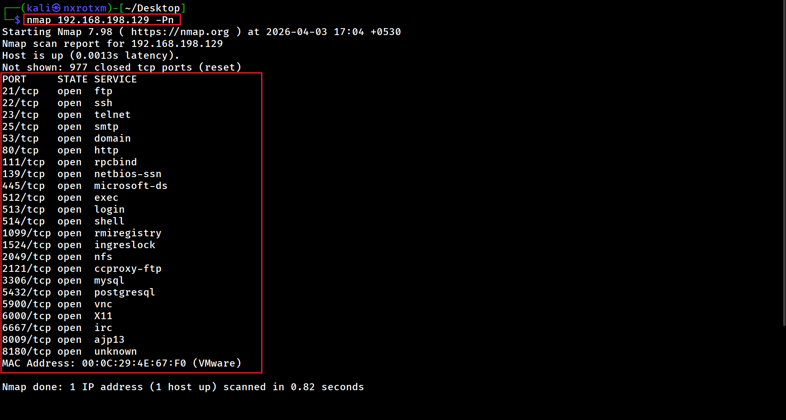

# 📘 Chapter 1: Introduction to Network Scanning & Ethical Hacking

---

## 🧠 What is Ethical Hacking?

Ethical hacking is the practice of testing systems, networks, and applications to find **security weaknesses** — legally and with proper authorization.

### ✅ Ethical hackers:

- ⚖️ Follow the law  
- 🔑 Work with permission  
- 🛡️ Help organizations improve security  

---

## 🎯 Why Network Scanning Matters

Before exploiting a system, you must first **understand it**.

Network scanning is the **first step in hacking**, used to:

- 🖥️ Discover live systems  
- 🔓 Identify open ports  
- 🧭 Detect running services  
- 🎯 Map the attack surface  

---

## 🏠 Real-World Analogy

Think of a target network like a house:

| Concept        | Real World Example |
|---------------|------------------|
| 🌐 IP Address | House address |
| 🚪 Ports      | Doors & windows |
| 🛠️ Services   | What’s inside the rooms |

👉 **Scanning = Checking which doors/windows are open**

---

## 🔗 Phases of Ethical Hacking

Every penetration test follows a structured process:

---

### 1️⃣ Reconnaissance (Information Gathering)
- Collect target information  
- Domain, IP, employees  

---

### 2️⃣ Scanning
- Find live hosts  
- Identify open ports  
- Detect services  

---

### 3️⃣ Enumeration
- Extract deeper information  
- Users, versions, shares  

---

### 4️⃣ Exploitation
- Use vulnerabilities to gain access  

---

### 5️⃣ Post-Exploitation
- Maintain access  
- Extract sensitive data  

---

### 6️⃣ Reporting
- Document findings  
- Provide remediation steps  

---

## ⚡ Summary

- 🧠 Ethical hacking = Legal security testing  
- 🔍 Scanning = First technical step  
- 🎯 Goal = Understand target before attack  

---

## ⚙️ What is Nmap?

**Nmap (Network Mapper)** is a powerful open-source tool used for:

- 🌐 Network discovery  
- 🔓 Port scanning  
- 🧭 Service detection  
- 🛡️ Vulnerability scanning  

---

## 🔥 Why Hackers Love Nmap

- ⚡ Fast and flexible  
- 🕵️ Supports stealth scanning  
- 🧩 Powerful scripting engine (NSE)  
- 💻 Works on almost all platforms  

---

## ⚠️ Legal Warning (IMPORTANT)

🚨 **Never scan systems without permission.**

Unauthorized scanning can:

- ⛔ Get you banned  
- ⚖️ Lead to legal action  
- 💣 Be considered a cyber attack  

---

## 🧪 Real-World Scenario

Imagine:

You are hired to test a company’s network.

Before doing anything:

- 🔍 You run scans  
- 🧭 Identify open services  
- 🎯 Look for weaknesses  

➡️ **Without scanning, you are blind**

---

# 📘 Chapter 2: Networking Basics for Hackers

---

## 🌐 Why Networking Knowledge is Critical

You cannot be a good hacker without understanding how networks work.

🧠 Nmap is not magic — it relies on:
- 📡 Protocols  
- 📦 Packets  
- 📜 Communication rules  

---

## 🧠 What is a Network?

A **network** is a group of devices connected to share data.

### Examples:
- 📶 Wi-Fi network  
- 🏢 Office network  
- 🌍 Internet  

---

## 🆔 IP Address (Identity of a Device)

An IP address is like a **unique ID** for a device.

---

## 🔎 Types of IP Addresses

### 🟢 Private IP
- Used inside local networks  
- Examples:
- 192.168.x.x
- 10.x.x.x

### 🔴 Public IP
- Visible on the internet  
- Assigned by ISP  

---

## 🚪 What is a Port?

A **port** is a communication endpoint.

👉 One device can run multiple services using different ports.

---

## 📊 Common Ports

| Port | Service | Description |
|------|--------|------------|
| 21   | FTP    | File transfer |
| 22   | SSH    | Remote login |
| 23   | Telnet | Insecure remote access |
| 25   | SMTP   | Email sending |
| 53   | DNS    | Domain resolution |
| 80   | HTTP   | Web traffic |
| 443  | HTTPS  | Secure web |

---

## 🚦 Port States (VERY IMPORTANT)

- 🟢 **Open** → Service is running  
- 🔴 **Closed** → No service  
- 🟡 **Filtered** → Firewall blocking  

---

## 📡 Protocols: TCP vs UDP

### 🔵 TCP (Transmission Control Protocol)
- Connection-oriented  
- Reliable  

**Used in:**
- HTTP  
- SSH  
- FTP  

---

### 🔴 UDP (User Datagram Protocol)
- Connectionless  
- Faster but less reliable  

**Used in:**
- DNS  
- Streaming  
- VoIP  

---

## 🤝 TCP 3-Way Handshake

This is critical for understanding Nmap scans:

## SYN → SYN-ACK → ACK

### Step-by-step:

1. Client sends **SYN**  
2. Server replies **SYN-ACK**  
3. Client sends **ACK**  

➡️ **Connection established**

---

## 🧠 Why This Matters for Nmap

Nmap manipulates this handshake:

- ⚡ **SYN Scan** → Does NOT complete handshake (stealthy)  
- 🔍 **TCP Scan** → Completes handshake  

---

## 🔥 Firewall Basics

A **firewall**:

- 🛡️ Monitors traffic  
- 🚫 Blocks suspicious packets  

### Example:
- Blocks unknown ports  
- Filters scanning attempts  

---

## 🧪 Real-World Scenario

You scan a target and see:
- 80/tcp | open | http
- 22/tcp | filtered | ssh

### 👉 Meaning:

- 🌐 Website is accessible  
- 🔒 SSH is blocked by firewall  

---

## 🔥 You Now Have Strong Foundation

After these chapters:

- 🧠 You understand how networks work  
- 🔍 You understand how Nmap thinks  

---

# 📘 Chapter 3: Nmap Practical Scanning (Real Commands)

---

## ⚡ Introduction

Now that you understand networking basics, it's time to **use Nmap in real scenarios**.

🎯 Goal: Learn how to scan targets like a real penetration tester.

---

# 🔍 Basic Scan

### 🔹 Command 1 : Host Discovery scan

 

### 📌 Description:

- Scans the entire network to identify and display live hosts.
- It does not scan ports.

### 📷 Output:

---

### 🔹 Command 2 : Basic scan/default scan

  

### 📌 Description:

- This is the default scan performed by Nmap.
- Scans the 1,000 most common ports.
- Scans the top 1,000 common ports and shows open ports with their running services.

### 📷 Output:

---

### 🔹 Command 3 : Multiple Target scan

  

### 📌 Description:

- Scans multiple IPs in one command.
- Used to quickly identify open ports on multiple IPs.

### 📷 Output:

---

### 🔹 Command 4 : Scan Entire Network

  

### 📌 Description:

- Scans all 256 IPs in a network.
- Used to quickly identify open ports for available IPs in entire network.

### 📷 Output:

---

### 🔹 Command 5 : Specific Port Scan

- Performs a scan to identify and display a single open port.
  
### 📷 Output:

---

### 🔹 Command 6 : Multiple Port Scan

- Performs a scan to identify and display only the specified open ports.
  
### 📷 Output:

---

### 🔹 Command 7 : All Port Scan

- Scans all 65,535 ports and displays open ports.
- Useful for deep enumeration
  
### 📷 Output:

---

### 🔹 Command 8 : Fast Port Scan

- Performs a scan to identify and display the top 100 open ports.
- Faster, but less detailed.
  
### 📷 Output:

---

### 🔹 Command 9 : Skip Ping Scan

### 📌 Description:

- Skips ping
- Assumes the host is up.
- This option is used when the firewall blocks ICMP packets.

### 📷 Output:

---

### 🔹 Command 10 : Save Outout

### 📌 Description:

- Saves results for later analysis.
- There are additional options to save output. For example, -oX saves in XML format, -oG in grepable format, and -oA saves all formats at once.

### 📷 Output:

---

# 🔍 ADVANCE SCAN

### 🔍 Advanced scanning helps you:

- Stay stealthy
- Detect services and OS
- Discover vulnerabilities
- Bypass firewalls.

---

### 🔹 Command 1 : Stealth Scan (SYN Scan)

### 📌 Description:

- Performs a half-open scan and does not complete the handshake.
- Performs a stealth scan that is less detectable.
- The output will be the same as a basic scan and will display all open ports along with the services running on them.

### 📷 Output:

---

### 🔹 Command 2 : TCP Connect Scan

### 📌 Description:

- Performs a scan using a complete TCP handshake.
- Since it completes the TCP handshake, it is more reliable.
- Because it completes the TCP handshake, it is easily detectable and logged.
- 

### 📷 Output:

---

### 🔹 Command 3 : UDP Scan

### 📌 Description:

- Scans for UDP services.

### 📷 Output:

---

### 🔹 Command 4 : Service Version Detection scan

### 📌 Description:

- Performs a port scan with service version detection.
- Scans 1,000 common ports and identifies services along with their versions.
- Attackers can identify vulnerabilities and exploits based on service version information.
- Outdated services may contain vulnerabilities that can be exploited.

### 📷 Output:

---

### 🔹 Command 5 : OS Detection scan

### 📌 Description:

- Attempts to identify the operating system of the host.
- Performs port scanning with operating system detection.
- Attackers perform OS detection scans so that they can find specific exploits related to the OS and service versions.

### 📷 Output:

---

### 🔹 Command 10 : Aggressive Scan

### 📌 Description:

- Performs OS detection, version detection,traceroute, and script scanning.

### 📷 Output:

---

### 🔹 Command 11 : Default Script Scan

### 📌 Description:

- Performs default script scanning on all open ports.

### 📷 Output:

---

### 🔹 Command 12 : Vulnerability Script Scan

### 📌 Description:

- Performs a vulnerability scan on all open ports.
- Not all screenshots are included below because it would be too long.

### 📷 Output:

---

## 🔥 Types of Scripts

- vuln → vulnerabilities
- auth → authentication checks
- brute → brute-force attempts

---

### 🔹 Command 13 : Packet Fragmentation Scan

### 📌 Description:

- Performs port scanning by sending fragmented packets.
- It Bypasses simple firewalls.

### 📷 Output:

---

### 🔹 Command 14 : Decoy Scan

### 📌 Description:

- Performs port scanning by sending fake IPs.
- It hides your real IP.

### 📷 Output:

---

### 🔹 Command 15 : Source Port Manipulation Scan

### 📌 Description:

- Performs port scanning by sending packets from port 53.
- Firewalls trust DNS traffic, so it will not block the packets.

### 📷 Output:

---

# 🔥 There are also commands available for speed and performance tuning.

- **nmap -T0 192.168.198.129**
   - Sends packets very slowly.
   - Avoid detection systems (IDS/IPS).
   - Extremely stealthy.

- **nmap -T1 192.168.198.129**
   - Slightly faster than T0, still very slow.
   - Stealth scanning with less time.
   - Still avoids many detection systems.
 
- **nmap -T2 192.168.198.129**
   - Slows scan to reduce network load.
   - When you don’t want to overload target.
   - Good for stable and careful scanning.
 
- **nmap -T3 192.168.198.129**
   - Default timing.
   - Balanced speed and accuracy.
   - Safe choice if unsure.

- **nmap -T4 192.168.198.129**
   - Faster scanning.
   - Faster results.
   - Works well in lab/CTF.

- **nmap -T5 192.168.198.129**
   - Extremely fast.
   - Very fast scans in controlled environments.
   - Used only when speed matters more than accuracy.

- **nmap--min-rate 1000 192.168.198.129**
   - Send packets no slower than 1000 per second.

- **nmap--max-retries 2 192.168.198.129**
   - Caps number of port scan probe retransmissions.

---

### ⏱️ Timing Strategy
- T0–T2 → Stealth scanning
- T3 → Default
- T4–T5 → Fast scanning

---

# 🔥 BEST COMMAND (You Should Use)

## **nmap -sS -sV -T4 192.168.198.129**

---

